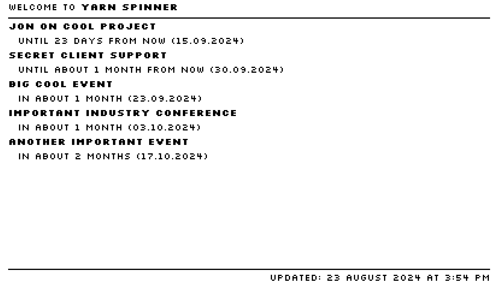

# Yarn Spinner's Office Frame

Yarn Spinner's office display shows a list of upcoming calendar events on a [Pimeroni Inky Frame 7.3](https://shop.pimoroni.com/products/inky-frame-7-3) e-ink display.



This repo contains the source code to the following:

- A web app that retrieves calendar information from a Notion calendar and displays it.
- A web server that serves the web app, and also allows downloading a server-generated screenshot of the web app as a PNG.
- Device firmware for a Pimeroni Inky Frame that periodically downloads and displays the screenshot from the server.

> [!IMPORTANT]
> While we hope this repo is interesting or useful, we aren't able to offer any support for it, and we aren't responsible for anything that might go wrong if you do choose to use it.
  
## Setting Up

First, you'll need to set up a Notion Integration, so that you have an API key to download data from your Notion.

- Go to https://www.notion.so/profile/integrations, and create a new Internal integration. Grant it access to a Notion that you're a Workspace Owner of. Give it a name, and write the API key down.
- In your Notion, create a new Database. It must have at least the following columns:
  - Name (type: title)
  - Date (type: date)
- Open the `...` menu at top right, open the Connect To... submenu, and select the Notion Integration you just connected.
- Open the `...` menu at top right again, and choose Copy Link. The link will look something like `https://www.notion.so/yourusername/0d2cb7f06ba5e0373bb45aa8e6aab17c?v=6d655cc221690f3cb59b8f983ad8d475` - copy the _first_ hex string (i.e. up to but not including the `?`). This is the database ID.

- Clone this repo, if you haven't already.
- Create a new file, `.env`. Put it in the root of this cloned repo. Add the following text to it:
```shell
NOTION_TOKEN="(your Notion integration token)"
CALENDAR_ID="(your database ID)"
```

## Install and Run Locally

- Install dependencies:
```shell
npm run setup
```
- Run the server locally:
```shell
npm run serve
```

The server will run on port 8080. You can check that this is all working by navigating to https://localhost:8080 - you should see your calendar. Navigate to https://localhost:8080/image and you should see a PNG version of your calendar. (It can take several seconds for Notion to return data to you, so be patient!)

## Set Up The Frame

- Open the file `inky-frame/main.py`, and review its settings. At minimum, you'll need to update the following variables:
  - `WIFI_SSID`
  - `WIFI_PASSWORD`
  - `IMG_URL`

- Upload this file to your Inky Frame and restart it.
- It should download and show the image on the screen!